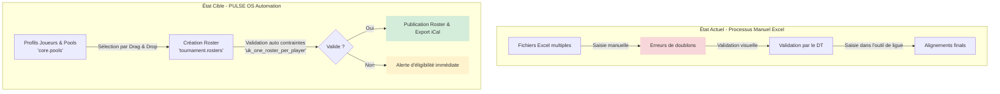

# Dossier de Cadrage & Exigences Fonctionnelles (PULSE OS)

Ce document constitue le dossier de cadrage fonctionnel de **PULSE OS**, aligné sur les meilleures pratiques d'architecture et d'analyse d'affaires :

* **BIZBOK®** (Business Architecture Body of Knowledge) : Alignement stratégique, capacités et chaîne de valeur.
* **BABOK® v3** (Business Analysis Body of Knowledge) : Ingénierie des exigences, périmètre et traçabilité.
* **Strategyzer** : Business Model Canvas & Value Proposition Canvas.
* **Value Stream Mapping (VSM)** : Cartographie et optimisation du flux de valeur.

## 1. Contextualisation Stratégique & Alignement (BIZBOK® & Strategyzer)

### 1.1 Alignement Stratégique & Modèle d'Affaires

* **Objectif stratégique :** Centraliser la gestion sportive opérationnelle des clubs de soccer (bassins, équipes de saison, alignements de tournoi), simplifier la planification des matchs/pratiques et poser les bases d'un suivi athlétique minimal via une architecture modulaire résiliente (PULSE OS - Go / React / PostgreSQL).
* **Business Model Canvas (Synthèse) :**
  * **Proposition de valeur :**
    * **Directeurs Techniques (DT) & Administrateurs :** Élimination des doublons d'inscription, respect strict de la règle *« un joueur, un alignement par événement »* et gestion fluide des bassins d'âge (*pools*).
    * **Entraîneurs / Staff :** Constitution rapide des alignements (*rosters*), consultation des calendriers et saisie d'évaluations athlétiques simplifiées.
    * **Représentants Familiaux & Joueurs :** Vue claire des horaires et de la composition des équipes sans confusion, synchronisation des calendriers familiaux.
  * **Segments de clientèle :** Clubs de soccer mineur (ex: Fury Rimouski, catégories U9-U10F à U18).
  * **Partenaires & Ressources clés :**
    * **Équipes :** DT, gérants d'équipe, entraîneurs, représentants familiaux.
    * **Ressources techniques :** Backend Go (Chi, Huma v2), PostgreSQL 16+ (schémas SQL étanches `core`, `tournament`, `scheduling`, `evaluation`), React/Vite.

### 1.2 Alignement de la Valeur (Value Proposition Canvas)

* **Profil Utilisateur (*Customer Profile*) :**
  * **Tâches (*Customer Jobs*) :** Regrouper les joueurs par catégories d'âge, former des équipes de saison et d'événement, suivre la participation et évaluer brièvement le niveau.
  * **Problèmes (*Pains*) :** Alignements multiples accidentels lors d'un même tournoi, fichiers Excel dispersés, mauvaise communication des horaires.
  * **Gains attendus (*Gains*) :** Intégrité garantie des alignements, accès en temps réel aux données d'équipe, saisie d'évaluation en moins de 2 minutes par joueur.
* **Carte de Valeur (*Value Map*) :**
  * **Produits & Services :** Modules **Core**, **Tournament**, **Scheduling** et **Evaluation (Light)**.
  * **Analgésiques (*Pain Relievers*) :** Validation applicative et contraintes BDD uniques (`uk_one_roster_per_player_per_event`) empêchant les conflits d'alignement.
  * **Générateurs de gains (*Gain Creators*) :** Découplage strict par schémas SQL (ADR-003) permettant une évolution rapide sans régression.

### 1.3 Chaîne de Valeur & Processus (Value Stream Mapping - VSM)

* Chaîne de valeur globale (BIZBOK® Value Stream)

  `Inscrire Joueurs / Bassins (Core)` ➔ `Former Groupes & Équipes (Tournament)` ➔ `Planifier Matchs & Pratiques (Scheduling)` ➔ `Diffuser aux Membres`

* Indicateurs clés VSM :
  * Temps de cycle (Cycle Time - CT) : Passage de 3-4 heures par catégorie d'âge (manuel) à moins de 10 minutes dans PULSE OS.
  * Temps à valeur ajoutée (VA) vs Non-valeur ajoutée (NVA) : Élimination de 90 % du temps NVA lié aux vérifications manuelles de doublons.
  * Goulots d'étranglement éliminés : Validation automatique au niveau base de données (index uniques partiels et contraintes CHECK) au lieu d'une vérification humaine par le DT.

#### Cartographie VSM du processus cible

## 2. Analyse du Périmètre & Stakeholders (BABOK®)

### 2.1 Analyse des Parties Prenantes (Stakeholder Analysis)

* Directeur Technique (DT) / Admin (Niveau Direction Club) - RACI: Accountable
Gère la structure, les bassins d'âge, les terrains et valide la constitution des équipes.
* Gérant(e) d'Équipe / Entraîneur (Niveau Staff Sportif) - RACI: Responsible
Compose les alignements (rosters), saisit les présences et remplit les fiches d'évaluation.
* Représentant Familial / Guardian (Niveau Membre / Famille) - RACI: Consulted
Parent, tuteur, grand-parent ou frère/sœur. Inscription, consultation et confirmation de présence.
* Joueur / Joueuse (Niveau Sportif) - RACI: Informed
Consulte son horaire, la composition de son équipe et ses fiches de progression.

Note sur la terminologie : Afin de couvrir toutes les réalités familiaux, l'application utilise la notion de Représentant Familial (Family Guardian) relié aux joueurs via la table core.family_guardians (PARENT, LEGAL_GUARDIAN, GRANDPARENT, SIBLING, OTHER).

## 2.2 Délimitation du Périmètre (Scope Boundary)

### Dans le Périmètre (Phase 1 / MVP v1.0)

* Module Core : Profils, Joueurs, Bassins / Pools, Représentants
* Module Tournament : Équipes, Alignements éphémères & Tournois
* Module Scheduling : Matchs, Pratiques, Terrains & Découpage 11v11 -> 7v7
* Module Evaluation Light : Fiches minimales & Calibre A/AA/AAA

### Hors Périmètre (Roadmap v2.0 & v3.0)

* Module Finance : Cotisations, Paiements Stripe & Budgets
* Module Brackets : Génération automatique de tableaux de tournoi
* Arbitrage : Gestion et paie des arbitres
* PWA Offline-First sur le terrain

## 3. Structure des Exigences : Epic -> Feature -> User Story

### EPIC-1 : Gestion de la Structure & des Équipes (Module Core & Tournament)

* FEAT-1.1 : Gestion des Bassins d'Âges (Pools)
  * US-1.1.1 : En tant que DT, je veux créer des bassins par année de naissance (ex: U10F), afin de regrouper les joueurs selon leur catégorie d'âge.
  * US-1.1.2 : En tant que DT, je veux assigner des joueurs à un bassin, afin de faciliter la constitution future des équipes.
* FEAT-1.2 : Constitution des Équipes de Saison & Groupes d'Entraînement
  * US-1.2.1 : En tant que DT, je veux créer un groupe d'entraînement (TRAINING_GROUP, 1:1 avec un bassin), afin d'organiser les séances d'entraînement régulières.
  * US-1.2.2 : En tant que DT, je veux créer une équipe de saison (SEASON_TEAM) pouvant combiner plusieurs bassins (ex: U9 + U10), afin d'inscrire le club en ligue régionale.
* FEAT-1.3 : Alignements d'Événements & Tournois (Event Rosters)
  * US-1.3.1 : En tant que Gérant d'équipe, je veux composer un alignement (EVENT_ROSTER) pour un tournoi spécifique, afin de soumettre la liste officielle des * joueurs.
  * US-1.3.2 : En tant que Système, je dois bloquer l'ajout d'un joueur dans deux alignements distincts pour un même événement (uk_one_roster_per_player_per_event), afin d'éviter les litiges d'éligibilité.

### EPIC-2 : Planification des Activités & Terrains (Module Scheduling)

* FEAT-2.1 : Gestion des Terrains & Sous-découpages
  * US-2.1.1 : En tant qu'Admin, je veux enregistrer les terrains du club et leurs sous-découpages (ex: terrain 11v11 divisé en deux 9v9 ou quatre 7v7), afin d'optimiser l'occupation des surfaces.
* FEAT-2.2 : Calendrier des Pratiques et Matchs
  * US-2.2.1 : En tant que Gérant, je veux planifier une pratique ou un match pour un groupe/équipe, afin d'alimenter le calendrier officiel.
  * US-2.2.2 : En tant que Représentant Familial, je veux consulter la liste des événements à venir pour mes enfants, afin de planifier la logistique familiale.

### EPIC-3 : Évaluation Minimale des Joueurs (Module Evaluation - Light)

* FEAT-3.1 : Grille d'Évaluation Simplifiée
  * US-3.1.1 : En tant qu'Entraîneur, je veux attribuer une note globale (calibre A/AA/AAA ou échelle 1-5) à un joueur à la fin d'un bloc d'entraînement, afin de consigner sa progression.
  * US-3.1.2 : En tant que DT, je veux consulter la fiche sommaire d'un joueur, afin de valider son classement lors de la constitution des équipes.

## 4. Feuille de Route Fonctionnelle Futur State (Backlog v2.0+)

### EPIC-4 : Gestion Financière & Cotisations (Module Finance - Out-of-Scope v1.0)

* US-4.1.1 (v2.0) : En tant que Représentant Familial, je veux payer la cotisation de mon enfant via Stripe Checkout, afin de valider son inscription en ligne.
* US-4.1.2 (v2.0) : En tant que Trésorier, je veux suivre les coûts d'inscription aux tournois par équipe, afin de respecter le budget annuel.

### EPIC-5 : Présences & Notifications Temps Réel (Module Scheduling Extended)

* US-5.1.1 (v2.0) : En tant que Représentant Familial, je veux confirmer/infirmer la présence de mon enfant à un match en 1 clic, afin d'aviser l'entraîneur.
* US-5.1.2 (v2.0) : En tant qu'Entraîneur, je veux recevoir des alertes Push en cas de désistement de dernière minute.

### EPIC-6 : Fonctionnalités & Copilotes IA (Module AI Copilot — Phase 2)

* FEAT-6.1 : Optimisation Automatique des Alignements (Roster Optimization AI)**
  * US-6.1.1 : En tant que DT, je veux demander au copilote IA de me proposer une répartition équilibrée de 60 joueuses en 4 équipes selon leur calibre et postes, afin d'éviter de passer 3 heures sur Excel.
  * US-6.1.2 : En tant que DT, je veux ajuster en Drag & Drop la proposition de l'IA avant de la valider définitivement en base de données.
* FEAT-6.2 : Saisie d'Évaluation Vocale (Voice-to-Evaluation AI)**
  * US-6.2.1 : En tant qu'Entraîneur sur le terrain, je veux dicter une note vocale de 30 secondes pour une joueuse, afin que l'IA l'analyse et mette à jour la fiche d'évaluation en critères structurés (JSON).
* FEAT-6.3 : Replanification Intelligente des Terrains (Scheduling Conflict AI)**
  * US-6.3.1 : En tant qu'Admin, lors d'une fermeture de terrain pour météo, je veux que l'IA me suggère la meilleure grille de reprise des matchs en minimisant les annulations.
* FEAT-6.4 : Assistant Virtuel Famille (RAG Family Assistant)**
  * US-6.4.1 : En tant que Représentant Familial, je veux poser des questions en langage naturel à l'assistant (ex: "Où se joue le match de samedi ?"), afin d'obtenir une réponse immédiate basée sur le calendrier officiel.

## 5. Matrice de Traçabilité (BABOK®)

| RF    | Module     | Description                                              | Référence |
| ----- | ---------- | -------------------------------------------------------- | --------- |
| RF-01 | core       | Isolement strict multi-tenant via sport_id               | US-1.1.1  |
| RF-02 | tournament | Contrainte d'unicité uk_one_roster_per_player_per_event  | US-1.3.2  |
| RF-03 | tournament | Contrainte CHECK (end_date >= start_date) sur événements | US-1.3.1  |
| RF-04 | scheduling | Sous-découpage relationnel scheduling.sub_fields         | US-2.1.1  |
| RF-05 | evaluation | Note globale & calibre sans dépendance FK dure sur core  | US-3.1.1  |

## 6. Exigences Non Fonctionnelles (NFR — Non-Functional Requirements)

### NFR-1 : Conformité Légale & Gestion du Consentement (Loi 25 Québec / LPIEC)

* **NFR-1.1 (Validation d'âge & Autorité Parentale) :** Pour tout joueur de moins de 14 ans, le système doit bloquer la création et la collecte de renseignements personnels jusqu'à l'obtention de la validation explicite du consentement par un *Family Guardian* majeur.
* **NFR-1.2 (Consentement IA / Données Vocales) :** Le module d'évaluation vocale doit imposer une case à cocher distincte (*Opt-In*) dans le profil du tuteur autorisant spécifiquement la numérisation et la transcription des notes vocales à des fins de suivi sportif.
* **NFR-1.3 (Droit à l'Oubli) :** L'API `core` doit fournir un endpoint permettant la suppression définitive (`Purge/Hard-Delete`) ou l'anonymisation irréversible de l'historique d'un joueur sous 30 jours après demande du titulaire.
* **NFR-1.4 (Portabilité des Données) :** Le système doit permettre au *Family Guardian* de télécharger l'ensemble du dossier de l'enfant dans un format ouvert et structuré (JSON ou CSV).

### NFR-2 : Sécurité & Anonymisation des Flux IA

* **NFR-2.1 (Masquage PII / Data Masking) :** L'adaptateur Go du module `ai` doit obligatoirement anonymiser ou pseudonymiser tout renseignement personnel identifiable (PII) avant sa transmission vers l'API de Groq/OpenAI. Seuls des identifiants opaques (`player_uuid`) et du contexte technique neutre peuvent être envoyés.
* **NFR-2.2 (Zéro Rétention des Tiers / Zero Data Retention) :** Les clés d'API et comptes fournisseurs (Groq/OpenAI) doivent être souscrits avec l'option explicite de non-conservation des prompts/transcriptions pour l'entraînement des modèles (*Zero Data Retention Policy*).
* **NFR-2.3 (Traitement Audio Temporaire) :** Les fichiers audio reçus pour le Speech-to-Text doivent être conservés exclusivement en mémoire vive (RAM / `io.Reader`) durant l'exécution de la requête de transcription et détruits immédiatement après. Aucun fichier audio brut ne doit résider sur disque.

### NFR-3 : Sécurité des Données & Chiffrement (Data Protection)

* **NFR-3.1 (Données en Transit) :** Toutes les communications entre le client Web (React), l'API Go (Huma v2) et les services externes (Groq, AWS) doivent être chiffrées via TLS 1.3 (HTTPS).
* **NFR-3.2 (Données au Repos) :** La base de données PostgreSQL doit être chiffrée au repos (*Encryption at rest*) en utilisant AES-256 (TDE ou chiffrement au niveau du volume de stockage).
* **NFR-3.3 (Isolation Multi-Tenant) :** L'isolation des schémas (`core`, `tournament`, `scheduling`, `evaluation`) et la vérification du `sport_id` / `club_id` doivent garantir qu'aucune requête ne puisse fuiter entre deux clubs ou catégories d'âge distincts.

### NFR-4 : Résilience & Dégradation Contrôlée (AI Fallback)

* **NFR-4.1 (Découplage de la Disponibilité API) :** Une panne ou une indisponibilité du fournisseur IA (Groq/OpenAI) ne doit à aucun moment impacter le fonctionnement de l'application principale. En cas de panne IA, les formulaires de saisie manuelle restent 100 % opérationnels.
* **NFR-4.2 (Timeout Strict) :** Les appels sortants vers les API IA doivent être encapsulés dans un `context.WithTimeout` Go de maximum 5 secondes pour le texte/JSON et 10 secondes pour l'audio, sous peine d'interruption automatique.
*
