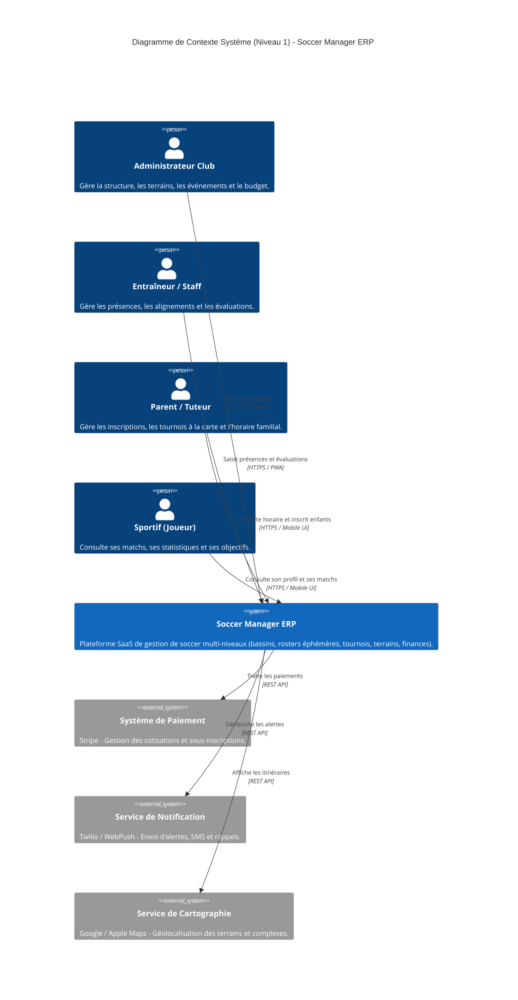
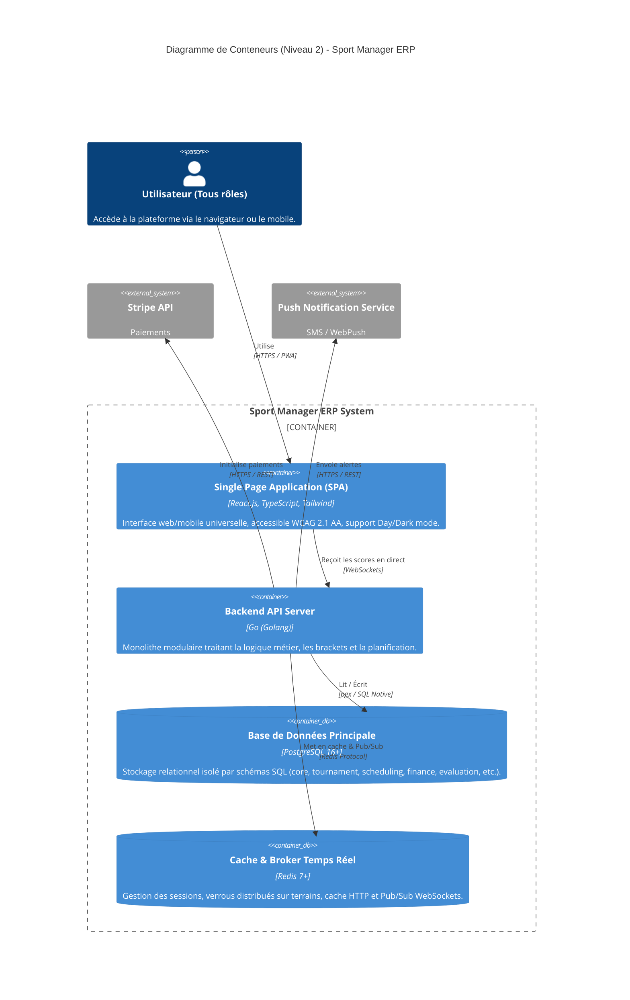
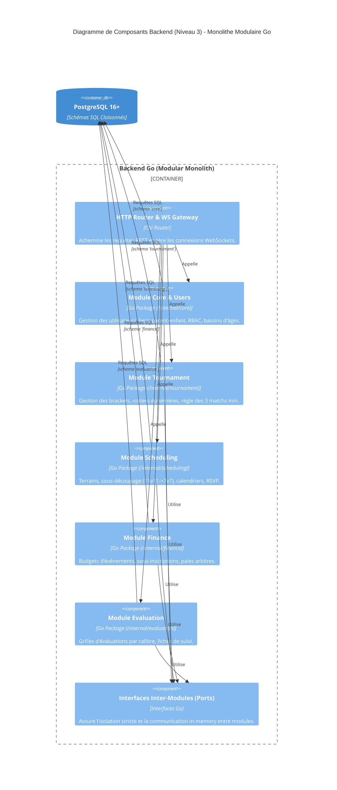
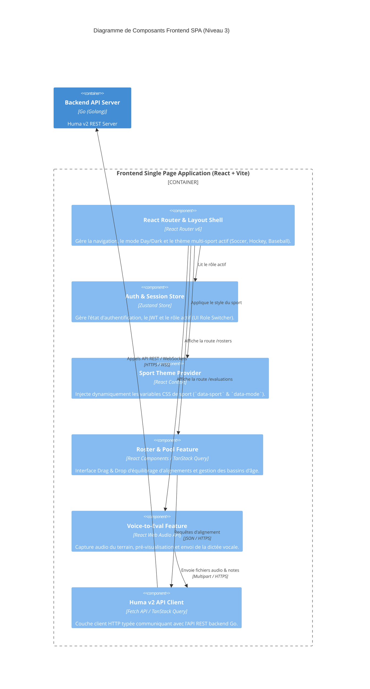
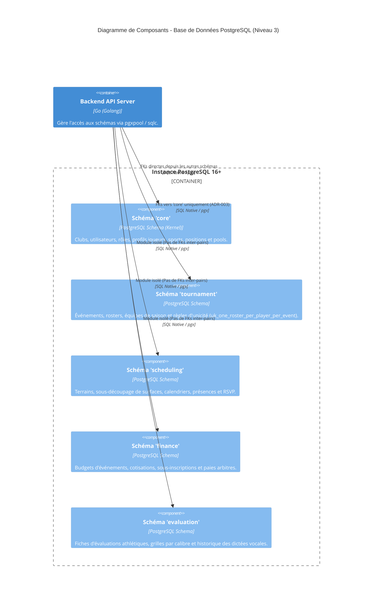
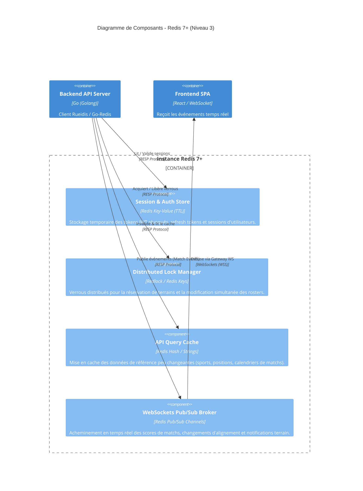

# ARCHITECTURE TECHNIQUE — PROJECT PULSE.OS

## 1. Contexte Système (Niveau 1)

L'application Soccer Manager ERP permet aux clubs, entraîneurs et parents de gérer la logistique sportive (bassins, rosters éphémères, tournois, terrains, finances et évaluations).
Le système communique avec des services tiers pour le paiement (Stripe), les notifications (SMS/Push) et la géolocalisation des terrains.

Ce diagramme illustre les interactions entre les utilisateurs, le système central et les services externes.

## 2. Conteneurs (Niveau 2)

* **Frontend SPA :** React.js + TypeScript (Mobile-First, PWA, Dark/Day Mode, WCAG 2.1 AA).
* **Backend API :** Go (Golang) sous forme de Monolithe Modulaire.
* **Base de Données :** PostgreSQL 16+ avec un schéma dédié par module.
* **Cache & Direct :** Redis (Pub/Sub WebSockets pour les scores et cache d'horaires).

## 3. Composants Backend (Niveau 3)

Chaque module dans `/internal/` respecte l'Architecture Hexagonale:

* **`domain` :** Modèles et règles métier purement Go (aucune dépendance).
* **`ports` :** Interfaces de communication d'entrée et de sortie.
* **`adapters` :** Implémentations concrètes (sqlc/PostgreSQL, Redis, In-Memory ou gRPC).

## 4. Composants Frontend SPA (Niveau 3 — Architecture React)

Structure interne de l'application Single Page Application (SPA) React en architecture modulaire par fonctionnalités (Feature-Driven Folder Structure).

## 3. Composants de Stockage & Persistance (Niveau 3 — PostgreSQL & Redis)

### A. Composants PostgreSQL (Schémas Isolés & Moteur de Données)

### B. Composants Redis (Cache, Sessions & Temps Réel)

## [TODO ARCHITECTURE C4]

* [ ] Spécifier les contrats protobuf/gRPC si un module doit être extrait en microservice.
* [ ] Modéliser le schéma de données détaillé du module `evaluation` (grilles dynamiques JSONB).
